# Guía de instalación del Framework Django en Docker

Introducción:

Con esta guía podrán instalar y trabajar con Django en Docker a través de Python

Conceptos básicos:

Docker: es una herramienta de código abierto diseñada para desarrollar y encapsular diversas aplicaciones, Docker tiene la facultad de separar tu proyecto funcional de tu computador, lo que se llama container el cual posee su propio sistema operativo y todas las configuraciones básicas para trabajar de forma correcta, finalmente gracias a esto se pueden desarrollar aplicaciones sin problemas de compatibilidad ya que este container funcionaria en cualquier computador.

Django: es un entorno de trabajo de alto nivel enfocado al desarrollo web integrado usando Python como su lenguaje principal, es un entorno robusto con la capacidad de hacer proyectos complejos y profesionales.

***Instalación Docker:***

**En Windows 10:**

Primero que todo debemos de instalar un backend de Ubuntu pues Docker corre nativamente en Linux para ello debemos de comenzar con instalar WSL2 encargado de correr este backend

Primero abrimos el Cmd o powerhsell con privilegios de administrador :

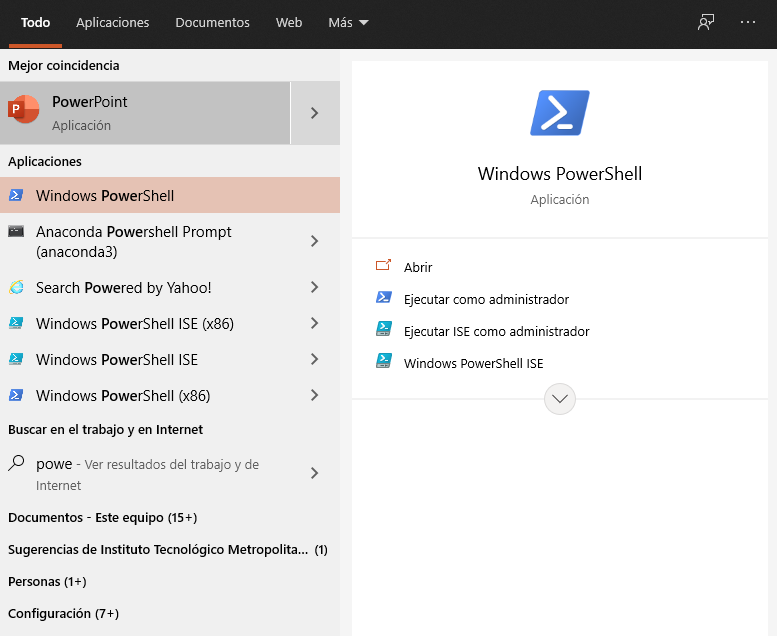

**Luego nos saldrá una ventana como esta:**

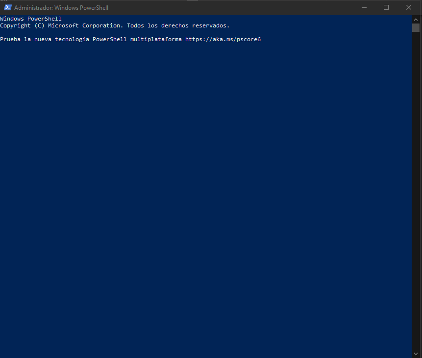

## Paso 2

En ella escribimos :

`dism.exe /online /enable-feature /featurename:Microsoft-Windows-Subsystem-Linux /all /norestart`
en el PowerShell

## Paso 3

Se comenzará a ejecutar el comando que tomará algunos minutos en donde instalará el WSL luego de esto seguimos con el siguiente comando:

`dism.exe /online /enable-feature /featurename:VirtualMachinePlatform /all /norestart`

Este comando se encargará de activar la máquina virtual previamente instalada, hecho esto

**Debemos de reiniciar el computador después de este paso**

## Paso 4

Debemos de descargar la actualización del Kernel de Linux del siguiente enlace:

<https://wslstorestorage.blob.core.windows.net/wslblob/wsl_update_x64.msi>

## Paso 5

Abrimos de nuevo el PowerShell como administrador y ejecutamos:

`wsl --set-default-version 2`

## Paso 6

Instalamos la distribución de Linux que mas nos guste en este caso la más recomendada es Ubuntu:

<https://aka.ms/wslstore>

El enlace anterior te abrirá el Microsoft Marketplace, donde allí encontrarás diferentes distribuciones de Linux.

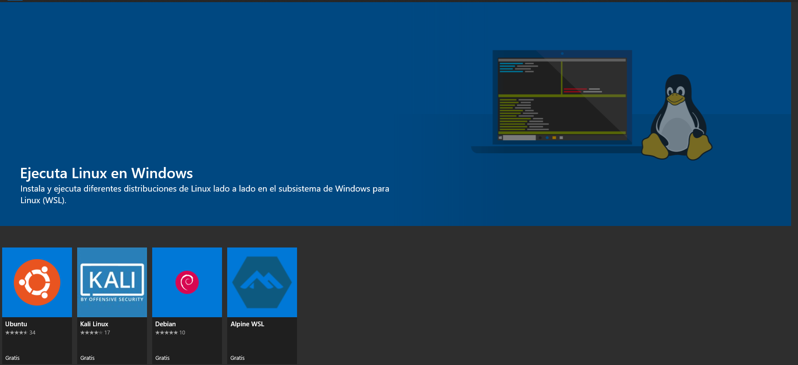

Hacemos Clic en obtener

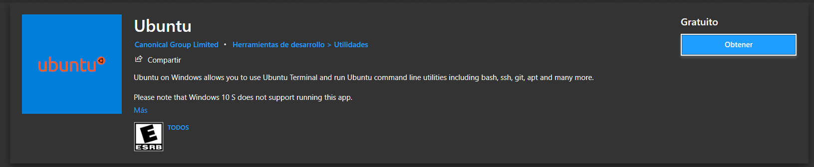

La primera vez que abres la aplicación te pedirá crear un nombre de usuario y contraseña.

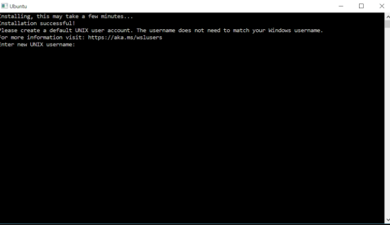

¡**Felicitaciones** ya tienes instalado Linux en Windows 10!

## Paso 6

Hechos todos los pasos anteriores ahora si comenzamos con Docker, para ello abrimos el siguiente enlace:

[Install Docker Desktop on Windows | Docker Documentation](https://docs.docker.com/docker-for-windows/install/)

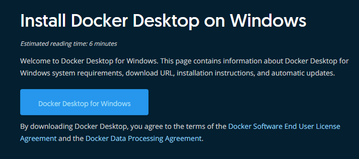

Nos centramos en esta vista y hacemos clic a ***Docker Dektop for Windows*** se comenzará a descargar un archivo ejecutable.

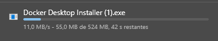

Es importante aclarar que esta aplicación pide como requisitos:

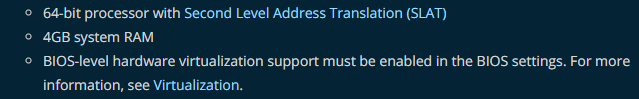

Después de la instalación abrimos la aplicación de Docker:

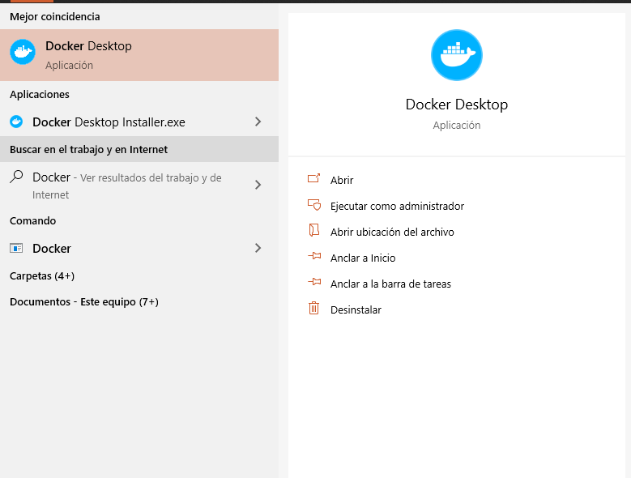

Una vez ejecutada la aplicación aparecerá en la barra de tareas este icono.

Que indica que el Docker está activado y ejecutando

Finalmente tenemos la aplicación lista para trabajar en ella

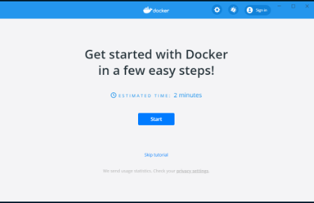

# Creación del Docker que contendrá al Framework Django:

Inicialmente debemos de crear una carpeta de trabajo, puede tener cualquier nombre siempre y cuando sea sin caracteres especiales y sin espacios:

Los comandos para usar son `mkdir nombrecarpeta`, `cd nombrecarpeta`

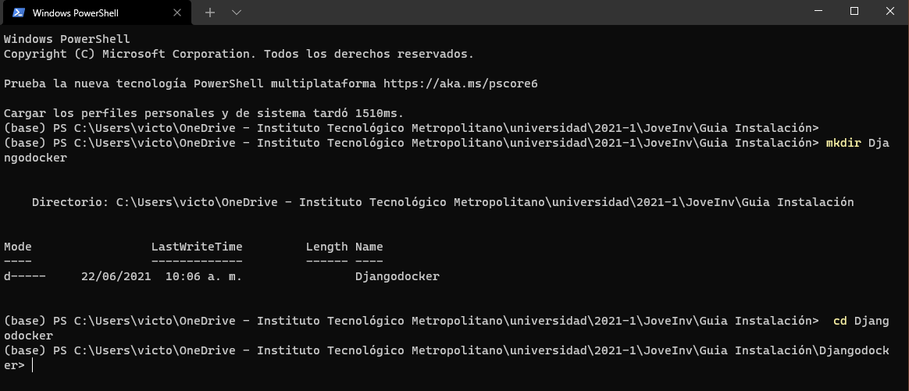

Creamos un archivo requirements.txt en el cual pondremos a Django como uno de los packpages

Ya que será el que vamos a utilizar

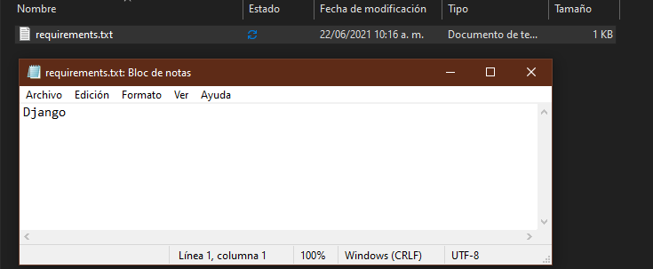

En el terminal que teníamos abierto anteriormente ejecutamos:

`pip install -r requirements.txt`

Una vez instalado Django en tu entorno de trabajo comenzamos por crear un proyecto de esta forma:

`django-admin startproject Mipagina`

Automáticamente te creará una carpeta con el nombre del proyecto

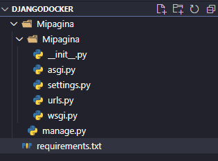

De esta forma, con el ***manage.py*** podrás controlar todo tu proyecto

A continuación, nos ubicamos dentro de la carpeta del proyecto:

`cd Mipagina`

Luego :

`Python manage.py runserver`

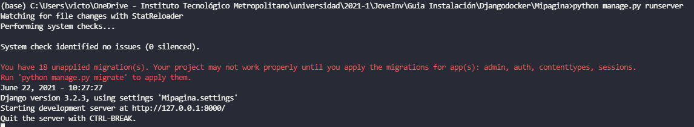

Abrimos el enlace que nos arroja el runserver:

<http://127.0.0.1:8000/>

**¡Ya tenemos nuestro primer sitio!**

**Los pasos para seguir son crear las aplicaciones para añadirle vistas y hacerlo más funcional**

**Si embargo no lo consideramos en esta guía pues nos compete dockerizar el Django**

Para ello creamos un archivo Dockerfile en nuestro entorno de desarrollo

En ella copiamos el siguiente código:

~~~ python
# Dockerfile

# The first instruction is what image we want to base our container on

# We Use an official Python runtime as a parent image

FROM python

# Allows docker to cache installed dependencies between builds

COPY requirements.txt requirements.txt

RUN pip install --no-cache-dir -r requirements.txt

# Mounts the application code to the image

COPY . code

WORKDIR /code

EXPOSE 8000

# runs the production server

ENTRYPOINT ["python", "Mipagina/manage.py"]

CMD ["runserver", "0.0.0.0:8000"]
~~~

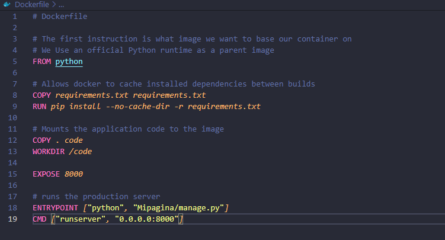

Luego en la consola:

`cd ..` para regresar a la carpeta raíz que inicialmente creamos

con este comando creamos el Docker con el nombre Python-django-app y como parámetro de entrada  .  que indica que es en la misma carpeta donde estará el dockerfile

`docker build -t python-django-app -f ./Dockerfile.txt .`

luego de ejecutar este comando saldrá esto:

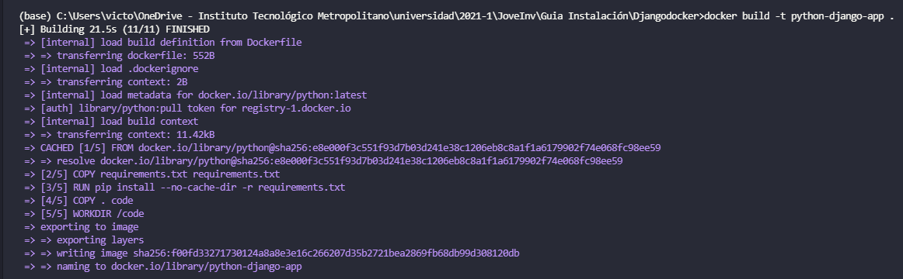

Indicando que nuestro contenedor ha sido creado de forma exitosa

Con el comando:

`docker run -it -p 8000:8000 python-django-app`

Lanzamos el contenedor exponiéndolo en el puerto 8000

El nombre del contendor lo crea automáticamente ya que nosotros estamos especificando únicamente nuestro nombre de la imagen.

**¡Con esto ya tenemos dockerizado nuestro proyecto de Django**!

### construido con 🛠️

* [Docker](https://docs.docker.com/get-docker/) - 🐋

* [Python](https://docs.python.org/3/) - 🐍
